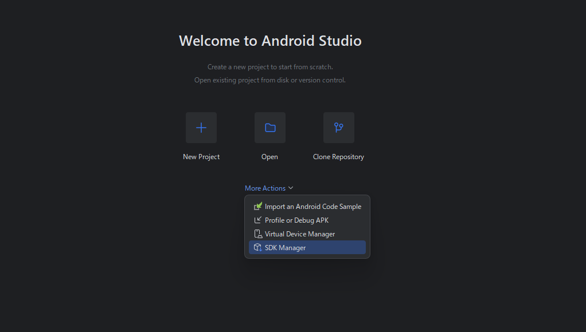
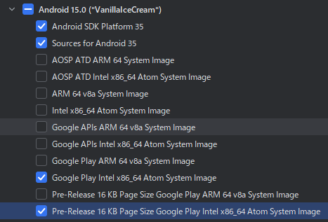
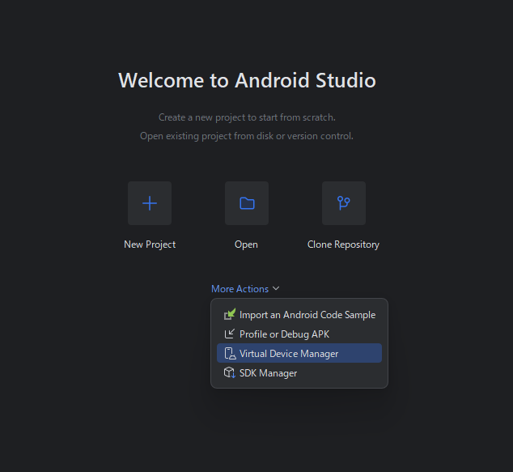
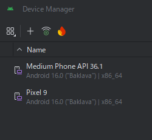
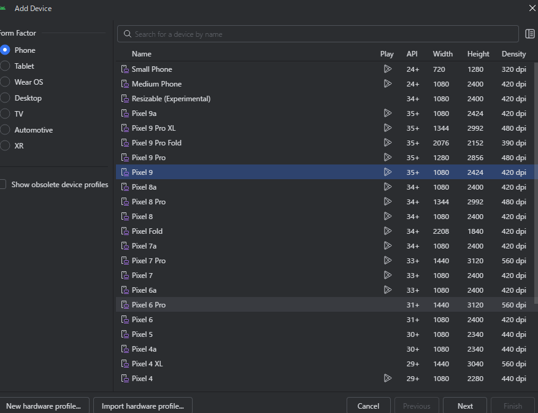
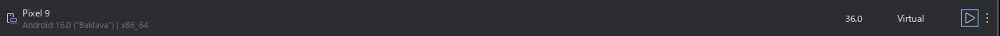
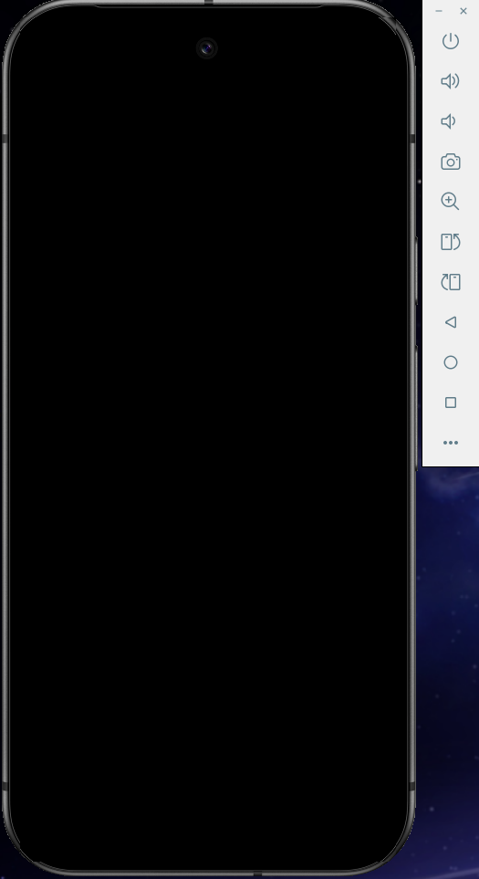
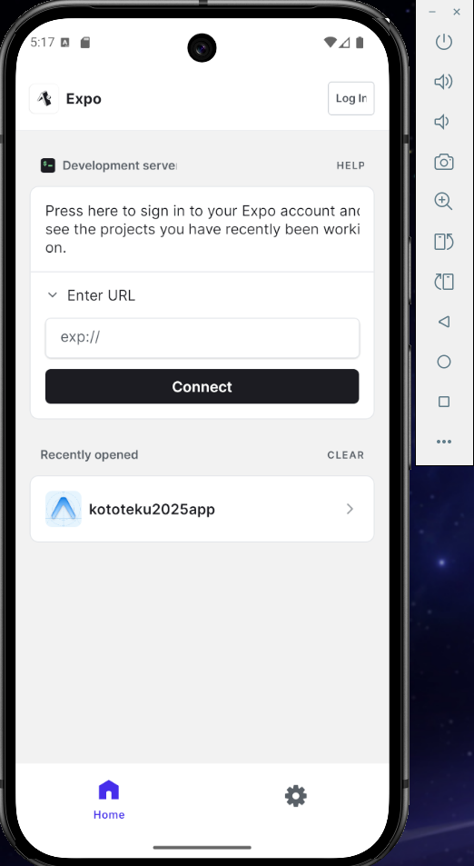

# kototeku2025app

## 環境構築

**前提**

- GitHubにsshでアクセスできる

- docker-desktopを導入している

- Windows11を使用している
***
### Android Studio

1. Android Studioをサイトからダウンロード＆インストール

https://developer.android.com/studio

ダウンロードをしたファイルからインストーラーを起動してインストール。

2. SDKをインストール

「More Actions」の「SDK Manager」からAndroid15をダウンロードする。



- Android SDK Platform 35
- Source for Android 35
- Google Play Intel x86_64 Atom System Image

  (macOSの場合は「Intel x86_64」が「ARM 64」のものを選んでください)

- Pre-Release 16KB Page Size Google Play Intel x86_64 Atom System Image

   (macOSの場合は「Intel x86_64」が「ARM 64」のものを選んでください)



すべてにチェックを入れたら「Apply」、「OK」を押してダウンロードしてください。

3. 環境変数を設定

Windowsのアプリの検索欄に「環境変数」と入力し、「環境変数を編集」を開きます。

「～～～のユーザー環境変数」の「新規」を押して、

変数名に「ANDROID_HOME」

変数値には先ほどのAndroid SDKを入れる画面の「Android SDK Location」の値を入れてください。


ターミナルで`Get-ChildItem -Path Env: `を実行して、

「ANDROID_HOME」と設定した変数値が表示されていれば成功です。

4. エミュレーターを起動

Android Studioの「More Actions」の「Virtual Device Manager」を開いてエミュレーターを起動する。



左上の「+」から新しいデバイスを追加する。


今回は「Pixel 9」を選択して「Next」を押す。



そのまま「Finish」を押して一覧画面に戻ってきたらPixel 9の「▶」を押す。



スマホが表示されたら電源を押して起動する。



5. Expo goをインストール

少し動作が重いと思いますが、GooglePlayから「Expo Go」をインストールしてください。

（みなさんご存じそうなので割愛）

***

### Docker
1. レポジトリをクローン

```sh
git clone git@github.com:hziulq/kototeku2025app.git
```

をターミナルで実行してレポジトリをクローンしてきます。

2. .envを設定する

ターミナルでレポジトリのフォルダ（ディレクトリ）に移動。.envを作成する

```PowerShell
cd kototeku2025app
Copy-Item .env.example .env
```

.envの中身を自身のipアドレスに変更する

（Wi-Fi設定やイーサネット設定から調べる。具体的な内容は割愛）

3. docker-composeを使用して環境構築を行う

コマンドを実行してdockerのコンテナを起動

```sh
docker compose up -d --build
```

dockerの環境に入ってExpoの開発サーバーを建てる。

```sh
docker compose exec expo-app sh
# /app # ←みたいなのが出てきたら成功
npm expo start
```

3. エミュレーターからアクセス

先ほどのコマンドを実行すると文字が流れてきますが、

その中に

 Metro waiting on exp://192.168.0.？:8081

の文字列があるはずなのでコピーしてExpo Goの「Enter URL」に張り付けて「Connect」を押してください



これでアプリのプレビューまで見ることができるようになりました。

以上

## 参考リンク

公式ドキュメント
https://docs.expo.dev/get-started/set-up-your-environment/?platform=android&device=simulated

DockerでReact Native + Expo環境の構築 - Zenn
https://zenn.dev/iput_app/articles/8051d4ad7e03bf